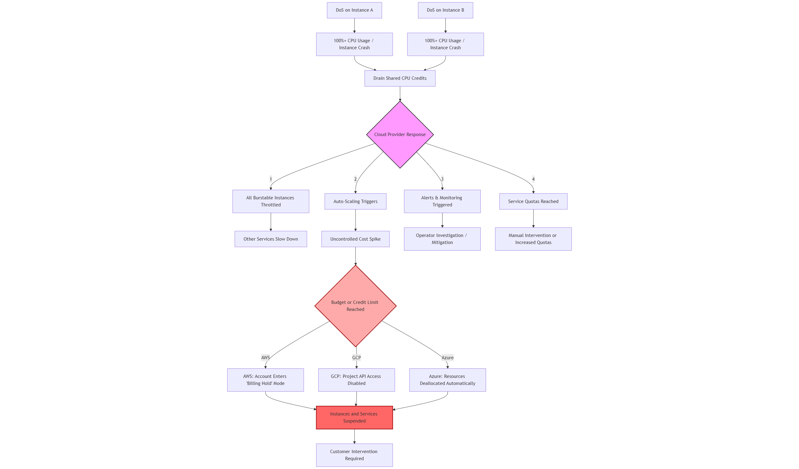
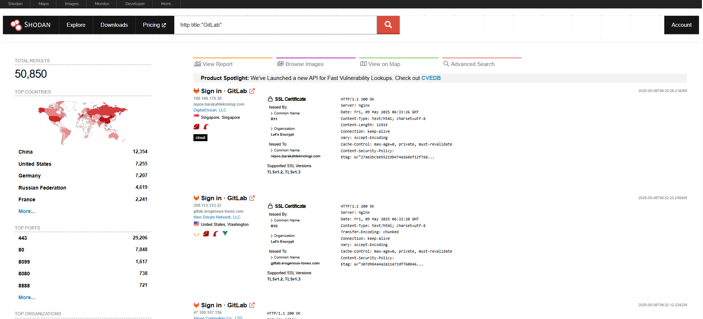

# Unauthenticated Gitlab DoS - POC Code

Uncontrolled Resource Consumption - 8vCPU &amp; 16GB RAM GCP Instance OOM Crash.

Gitlab doesn't accept 99.9% of DoS vulnerabilities. This vulnerability is out-of-scope unfortunately 😔.

`DoS vulnerabilities caused by unlimited input fields`

Out-of-scope bugs are useless noise (🗑️) — they waste time chasing irrelevant issues that don’t impact the actual target, like reporting a typo in a login page’s footer. They distract from real threats, clog reports with garbage, and show you didn’t bother reading the rules.

Submitting them is like demanding a refund for a sandwich you didn’t order.

## Video POC

[](https://youtu.be/VGsuyPKELqo)

## Quick Start

1. Clone the repository:
```
git clone https://github.com/justas-b1/Gitlab-DoS.git
cd Gitlab-DoS
```

2. Run
```
python lfs.py --domain https://your-gitlab-domain.com
```

## Command-Line Arguments

| Argument  | Description | Default Value |
| ------------- | ------------- | ------------- |
| --domain     | Target GitLab instance URL  | https://c40b-88-222-161-135.ngrok-free.app |
| --file_name     | Payload file  | lfs_payload_3mb.json |
| --threads     | Total number of threads | 333 |
| --delay     | Limits the creation of new threads - 1 is 1 RPS, 0.5 is 2RPS, etc.  | 1 |

## Explanation

The /info/lfs/objects/batch endpoint accepts and renders unlimited JSON input. In the backend, it performs multiple resource-heavy operations, which would be fine if the input was under 1KB.

### Impact

Auto-scaling under attack can cause a cost spike, potentially breaching budget thresholds or credit limits.

If there's no auto-scaling and instance is default, recommended 8vCPU and 16GB ram:

In Linux, an OOM (Out-of-Memory) crash is technically referred to as an "OOM Killer event" or "OOM-induced system termination." In POC video, it crashes at ~2:30.



**Attack Vector (AV:N)** - Attacker can exploit this remotely.

**Attack Complexity (AC:L)** - Attack uses a very simple python script.

**Privileges Required (PR:N)** - The endpoint is unauthenticated.

**User Interaction (UI:N)** - There's no user interaction required.

**Scope (S:C)** - Changed. Affects VM, which is above Gitlab application and also affects cloud hosting account if auto-scaling is enabled.

**Integrity Impact (I:N)** - None. Might be low if temporary data is lost during VM crash.

**Availability Impact (A:H)** - High. Instance crashes completely, unavailable for all users.

From https://gitlab-com.gitlab.io/gl-security/product-security/appsec/cvss-calculator/

`When evaluating Availability impacts for DoS that require sustained traffic, use the 1k Reference Architecture. The number of requests must be fewer than the "test request per seconds rates" and cause 10+ seconds of user-perceivable unavailability to rate the impact as A:H.`

This attack used only 1RPS which eventually caused an OOM crash on 1k Reference Architecture instance.

## Code Explanation

`generate_lfs_objects(n)`

Generates n dummy LFS objects with sequential fake OIDs (SHA256 hashes).

`create_payload_file(file_name)`

Creates a JSON payload (e.g., lfs_payload_3mb.json) with LFS batch request data. This is useful if you don't want to regenerate payload every run.

`discover_lfs_endpoint(domain)`

Uses curl to fetch the LFS API endpoint from a GitLab instance’s public projects.

`send_test_request(payload_file, lfs_endpoint)`

Sends a test request and checks for HTTP 413 Payload Too Large errors. This is for these edge cases where maximum accepted body size is 1MB.

`send_curl_request(thread_num, payload_file, lfs_endpoint)`

Threaded function to send payloads to LFS endpoint.

## 💡 Company Information

GitLab is a web-based DevOps platform that provides an integrated CI/CD pipeline, enabling developers to plan, develop, test, and deploy code seamlessly. Key features include:

- Version Control (Git)
- Issue Tracking 🐛
- Code Review 🔍
- CI/CD Automation 🚀

## 🏢 Who Uses GitLab?

GitLab is trusted by companies of all sizes, from startups to enterprises, including:

| Company                                            | Industry                  | Description                                                                                                                   |
| -------------------------------------------------- | ------------------------- | ----------------------------------------------------------------------------------------------------------------------------- |
| [Goldman Sachs](https://www.goldmansachs.com/)     | Finance 💵                | A global investment bank using GitLab to modernize software pipelines and improve developer efficiency.                       |
| [Siemens](https://www.siemens.com/)                | Engineering ⚙️            | A global tech powerhouse leveraging GitLab for collaborative development in industrial automation and digital infrastructure. |
| [NVIDIA](https://www.nvidia.com/)                  | Technology 💻             | A leader in GPUs and AI computing, NVIDIA uses GitLab for scalable CI/CD and code management.                                 |
| [T-Mobile](https://www.t-mobile.com/)              | Telecommunications 📱     | Uses GitLab to manage internal tools and rapidly deliver new digital services to customers.                                   |
| [NASA](https://www.nasa.gov/)                      | Aerospace 🚀              | NASA utilizes GitLab for managing mission-critical code in scientific and engineering applications.                           |
| [Sony](https://www.sony.com/)                      | Entertainment 🎮          | Uses GitLab to support development workflows across gaming, electronics, and entertainment platforms.                         |
| [UBS](https://www.ubs.com/)                        | Banking 🏦                | A Swiss banking giant leveraging GitLab for secure, compliant DevOps in financial applications.                               |
| [Lockheed Martin](https://www.lockheedmartin.com/) | Defense & Aerospace 🛡️   | Employs GitLab for secure software development in defense systems and space technologies.                                     |
| [Shopify](https://www.shopify.com/)                | E-commerce 🛒             | Uses GitLab to scale DevOps practices and support its cloud-based e-commerce platform.                                        |
| [ING](https://www.ing.com/)                        | Financial Services 💳     | A Dutch bank adopting GitLab to improve developer collaboration and accelerate delivery.                                      |
| [CERN](https://home.cern/)                         | Scientific Research 🔬    | The European Organization for Nuclear Research uses GitLab to coordinate complex software across global teams.                |
| [Splunk](https://www.splunk.com/)                  | Data Analytics 📊         | Relies on GitLab for managing code and automating builds in its data platform ecosystem.                                      |
| [Comcast](https://corporate.comcast.com/)          | Media & Communications 📺 | Uses GitLab to streamline application delivery across their massive entertainment and broadband network.                      |
| [Deutsche Telekom](https://www.telekom.com/)       | Telecommunications 🌍     | Applies GitLab for agile development and managing cloud-native telecom infrastructure.                                        |
| [Alibaba](https://www.alibaba.com/)                | Tech & E-commerce 🧧      | One of the world’s largest tech firms, using GitLab to scale development across massive infrastructure.                       |

## 🛡️ GitLab in Defense

GitLab is favored by U.S. Department of Defense (DoD) agencies for secure, self-hosted DevSecOps environments, offering:

- On-Premise Deployment 🖥️
- Security & Compliance 🔒

Its ability to manage sensitive data and maintain operational control makes GitLab a key tool for government and defense sectors.

## 🌐 Affected Websites

Shodan query: 

```
http.title:"GitLab"
```

Returns over 50,000 publicly exposed GitLab instances. Some servers allow new user sign-ups without admin approval, which may permit unauthorized access to project listings or internal repositories.



## ⚠️ Legal Disclaimer  
This Proof-of-Concept (PoC) is provided **for educational purposes only**.  

- **Authorized Use Only**: Test only on systems you own or have explicit permission to assess.  
- **No Liability**: The author is not responsible for misuse or damages caused by this tool.  
- **Ethical Responsibility**: Do not use this tool to violate laws or exploit systems without consent.  

By using this software, you agree to these terms. 
